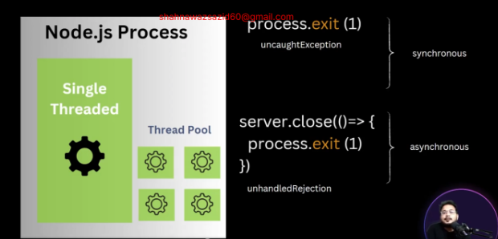
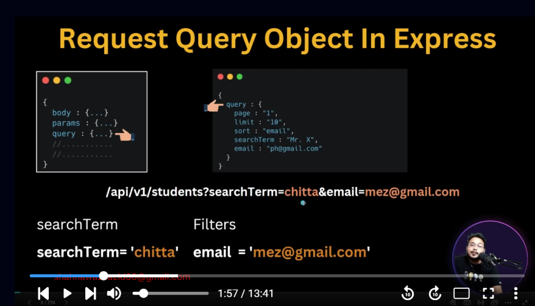
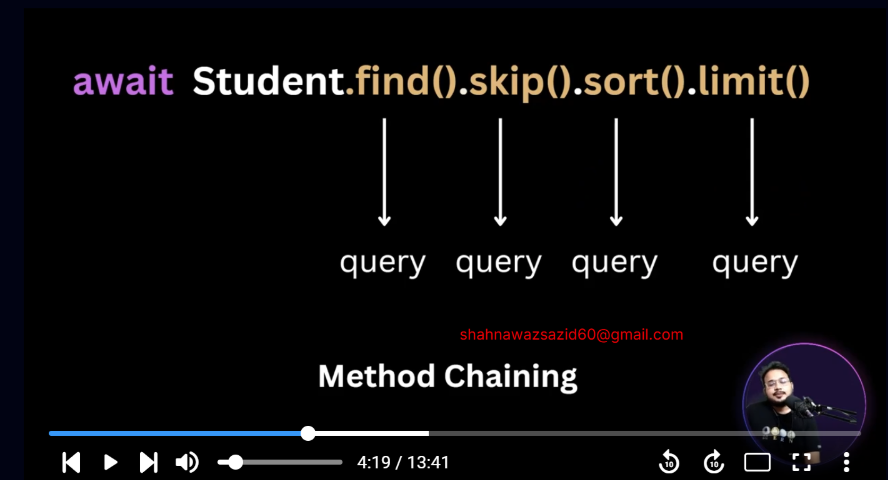

# PH-UNIVERSITY-4

## 14-1 What is Error Handling

### WE WILL KNOW

- Error Handling
- Searching
- Filtering
- Pagination
- Practice Task will be given

#### Error Handling


#### Operational Error (We can Handle it in express application)

- Errors that we can predict will happen in future
  1. Invalid User Input
  2. Failed to run server
  3. Failed to connect database
  4. Invalid auth token

#### Programmatic Error (We can Handle it in express application)

- Errors that developers produces when developing

  1. using undefined variables
  2. using properties that do not exist
  3. passing number instead of string
  4. using req.params instead of req.query

- Operational and Programmatic Error wll happen inside the application so these can be handles inside express application

#### Unhandled Rejection(Asynchronous code)

#### Uncaught Expectation (synchronous Code)

- These two can be inside or outside the express application


- for production we will not give the stack

## 14-2 Understanding Error Patterns in Zod and Mongoose

- ZodError is a subclass of Error; you can create your own instance easily:
- To checking class or instance we have to use instanceof operator

```ts
type TErrorSource = {
  path: string | number;
  message: string;
}[];

let errorSource: TErrorSource = [
  {
    path: '',
    message: 'Something Went Wrong',
  },
];

// ZodError is a subclass of Error; you can create your own instance easily
// To checking class or instance we have to use instanceof operator
if (err instanceof ZodError) {
  statusCode = 400;
  message = 'Ami Zod Error';
}
```

[ZOD ERROR HANDLING](https://zod.dev/ERROR_HANDLINGhttps://zod.dev/ERROR_HANDLING)

- First we have to trace in which structure our error is coming and then we will organize our error handler based on that

## 14-3 How to Convert Zod Error

- First We Will Detect The Error and then using the handler we will modify the error according to us

```ts
/* eslint-disable no-unused-vars */
/* eslint-disable @typescript-eslint/no-unused-vars */

import { ErrorRequestHandler } from 'express';
import { ZodError, ZodIssue } from 'zod';
import { TErrorSource } from '../interface/error';
import config from '../config';

// global error handler
const globalErrorHandler: ErrorRequestHandler = (err, req, res, next) => {
  // setting default values
  let statusCode = err.statusCode || 500;
  let message = err.message || 'Something Went Wrong';

  let errorSources: TErrorSource = [
    {
      path: '',
      message: 'Something Went Wrong',
    },
  ];

  // this handler will convert the error to our desired error
  const handleZodError = (err: ZodError) => {
    const errorSources: TErrorSource = err.issues.map((issue: ZodIssue) => {
      return {
        path: issue?.path[issue.path.length - 1],
        // we are taking the last index of the issue because last index holds the actual path in zod error
        message: issue.message,
      };
    });
    const statusCode = 400;
    return {
      statusCode,
      message: 'Validation Error',
      errorSources,
    };
  };
  // ZodError is a subclass of Error; you can create your own instance easily

  // To checking class or instance we have to use instanceof operator
  //  detecting the error
  if (err instanceof ZodError) {
    // this will over write the error
    const simplifiedError = handleZodError(err);
    // console.log(simplifiedError);
    // will be simplified by handle error
    // over wite the errors
    statusCode = simplifiedError?.statusCode;
    message = simplifiedError?.message;
    errorSources = simplifiedError?.errorSources;
  }
  // Send the response without returning it
  res.status(statusCode).json({
    success: false,
    message,
    errorSources,
    stack: config.NODE_ENV === 'development' ? err?.stack : null,
  });
};

export default globalErrorHandler;

// error Format
/*
success
message
errorSources :[
path:'',
message:'',
]
stack*/
```

## 14-4 How to convert mongoose validation error

- Mongoose isa The First Layer and Zod is on Top Of Mongoose
- Practically zod will handle most of the errors a fewer time will be handled by mongoose

```ts
import mongoose from 'mongoose';
import { TErrorSources } from '../interface/error';

const handleValidationError = (err: mongoose.Error.ValidationError) => {
  const errorSources: TErrorSources = Object.values(err.errors).map(
    (val: mongoose.Error.ValidatorError | mongoose.Error.CastError) => {
      return {
        path: val?.path,
        message: val?.message,
      };
    },
  );

  const statusCode = 400;
  return {
    statusCode,
    message: 'Zod Validation Error',
    errorSources,
  };
};

export default handleValidationError;
```

## 14-5 How to handle castError and 11000 error

- Validating Error Response Type

```ts
import mongoose from 'mongoose';
import { TErrorSources } from '../interface/error';

type TGenericErrorResponse = {
  statusCode: number;
  message: string;
  errorSources: TErrorSources;
};

const handleValidationError = (
  err: mongoose.Error.ValidationError,
): TGenericErrorResponse => {
  const errorSources: TErrorSources = Object.values(err.errors).map(
    (val: mongoose.Error.ValidatorError | mongoose.Error.CastError) => {
      return {
        path: val?.path,
        message: val?.message,
      };
    },
  );

  const statusCode = 400;
  return {
    statusCode,
    message: 'Mongoose Validation Error',
    errorSources,
  };
};

export default handleValidationError;
```

- Handling cast error means It will handle invalid id error

```ts
import mongoose from 'mongoose';
import { TErrorSources, TGenericErrorResponse } from '../interface/error';

const handleCastError = (
  err: mongoose.Error.CastError,
): TGenericErrorResponse => {
  const errorSources: TErrorSources = [
    {
      path: err.path,
      message: err.message,
    },
  ];
  const statusCode = 400;
  return {
    statusCode,
    message: 'Invalid Id',
    errorSources,
  };
};

export default handleCastError;
```

- Handling Duplicate Error

```ts
import { TErrorSources, TGenericErrorResponse } from '../interface/error';

const handleDuplicateError = (err: any): TGenericErrorResponse => {
  const match = err.message.match(/"([^"]*)"/);

  const extractedMessage = match && match[1];
  const errorSources: TErrorSources = [
    {
      path: '',
      message: `${extractedMessage} is already exist`,
    },
  ];
  const statusCode = 400;
  return {
    statusCode,
    message: 'Invalid Id',
    errorSources,
  };
};

export default handleDuplicateError;
```

## 14-6 How to handle Error, AppError, UnhandledRejection, UncaughtException

- In Some Part we have used throw new Error now its time to handle this error

```ts
else if (err instanceof AppError) {
    statusCode = err?.statusCode;
    message = err?.message;
    errorSources = [
      {
        path: '',
        message: err?.message,
      },
    ];
  } else if (err instanceof Error) {
    message = err?.message;
    errorSources = [
      {
        path: '',
        message: err?.message,
      },
    ];
  }
```

#### uncaughtException

- Node.js is a process. To stop the process we have to use process.exit(1) if we we get and error in synchronous code.

#### unhandledRejection

- if we get from asynchronous way we have to try this way to stop

```ts
server.close(() => {
  process.exit(1);
});
```

- it means politely turning off like it lets all works to be closed and the turn off



- we will not do these in globalErrorHandler since it just handles error of express application

- For checking unhandledRejection() an uncaught

```ts
const test = (req: Request, res: Response) => {
  // Promise.reject() //for checking unhandledRejection
  res.send('Server is running');
};

app.get('/', test);
```

```ts
import mongoose from 'mongoose';
import app from './app';
import config from './app/config';
import { Server } from 'http';

let server: Server;
async function main() {
  try {
    await mongoose.connect(config.database_url as string);

    server = app.listen(config.port, () => {
      console.log(`Example app listening on port ${config.port}`);
    });
  } catch (err) {
    console.log(err);
  }
}

main();

// vodro vabe thamabe (For unhandled Rejection)
process.on('unhandledRejection', () => {
  console.log(`unhandled rejection is detected, shutting Down`);
  if (server) {
    server.close(() => {
      process.exit(1);
    });
  }
  process.exit(1);
});

process.on('uncaughtException', () => {
  console.log(`unhandled rejection is detected, shutting Down`);
  process.exit(1);
});

// console.log(x);
```

## 14-7 How to do raw Searching and filtering

- searchTerm is partial
- Filter is exact match



- we will tell backend to search in specific field
- in case of filter we will tell the exact field and the exact value



- we can do this since every one is giving a query

- Searching using Search Term

```ts
const getAllStudentsFromDB = async (query: Record<string, unknown>) => {
  // {email :{$regex : query.searchTerm, $option:i}}
  // {presentAddress :{$regex : query.searchTerm, $option:i}}
  // {'name.firstName' :{$regex : query.searchTerm, $option:i}}

  let searchTerm = '';

  if (query?.searchTerm) {
    searchTerm = query.searchTerm as string;
  }
  const result = await Student.find({
    $or: ['email', 'name.firstName', 'presentAddress'].map((field) => ({
      [field]: { $regex: searchTerm, $options: 'i' },
    })),
  })
    .populate('admissionSemester')
    .populate({
      path: 'academicDepartment',
      populate: {
        path: 'academicFaculty',
      },
    });
  // nested populate is done since academic faculty inside academic department is still showing id
  return result;
};
```

- Search Sort Filter Limit

```ts
// getting data service
const getAllStudentsFromDB = async (query: Record<string, unknown>) => {
  // {email :{$regex : query.searchTerm, $option:i}}
  // {presentAddress :{$regex : query.searchTerm, $option:i}}
  // {'name.firstName' :{$regex : query.searchTerm, $option:i}}

  console.log('Base Query :', query);

  // making  a copy of the query so that original query do not change

  const queryObj = { ...query };
  const studentSearchableFields = ['email', 'name.firstName', 'presentAddress'];
  let searchTerm = '';

  if (query?.searchTerm) {
    searchTerm = query.searchTerm as string;
  }

  // we are using chaining
  const searchQuery = Student.find({
    $or: studentSearchableFields.map((field) => ({
      [field]: { $regex: searchTerm, $options: 'i' },
    })),
  });

  // filtering
  const excludeFields = ['searchTerm', 'sort', 'limit'];
  excludeFields.forEach((el) => delete queryObj[el]);
  // console.log({ query, queryObj });

  // http://localhost:5000/api/v1/students?searchTerm=sazid&email=sazid@e.com
  //  for sorting http://localhost:5000/api/v1/students?sort=-email this means descending order
  // for limiting http://localhost:5000/api/v1/students?limit=1

  const filterQuery = searchQuery
    .find(queryObj)
    .populate('admissionSemester')
    .populate({
      path: 'academicDepartment',
      populate: {
        path: 'academicFaculty',
      },
    });
  // nested populate is done since academic faculty inside academic department is still showing id

  let sort = '-createdAt';

  if (query.sort) {
    sort = query.sort as string;
  }

  const sortQuery = filterQuery.sort(sort);

  let page = 1;
  // limiting
  let limit = 1;

  if (query.page) {
    page = Number(query.page);
  }
  if (query.limit) {
    limit = query.limit;
  }

  const limitQuery = await sortQuery.limit(limit);

  return limitQuery;
};
```

## 14-9 How to do pagination and field limiting

- Limit is related to pagination
- We Will take the page and limit value from frontend


- pagination

```ts
let page = 1;
let skip = 0;
// limiting
let limit = 1;

if (query.limit) {
  limit = Number(query.limit);
}

if (query.page) {
  page = Number(query.page);
  skip = (page - 1) * limit;
}

const paginateQuery = sortQuery.skip(skip);

const limitQuery = await paginateQuery.limit(limit);

return limitQuery;
```

- Field Filtering means i want to see only the specific fields

```ts
// field limiting
let fields = '-__v'; // this means - means skip this fields

// fields:'name,email' so we have to convert it to fields:'name email'

if (query.fields) {
  fields = (query.fields as string).split(',').join(' ');
  console.log({ fields });
}

const fieldQuery = await limitQuery.select(fields);

return fieldQuery;
```

- with all

```ts
// getting data service
const getAllStudentsFromDB = async (query: Record<string, unknown>) => {
  // {email :{$regex : query.searchTerm, $option:i}}
  // {presentAddress :{$regex : query.searchTerm, $option:i}}
  // {'name.firstName' :{$regex : query.searchTerm, $option:i}}

  // console.log('Base Query :', query);

  // making  a copy of the query so that original query do not change

  const queryObj = { ...query };
  const studentSearchableFields = ['email', 'name.firstName', 'presentAddress'];
  let searchTerm = '';

  if (query?.searchTerm) {
    searchTerm = query.searchTerm as string;
  }

  // we are using chaining
  const searchQuery = Student.find({
    $or: studentSearchableFields.map((field) => ({
      [field]: { $regex: searchTerm, $options: 'i' },
    })),
  });

  // filtering
  const excludeFields = ['searchTerm', 'sort', 'limit', 'page', 'fields'];
  excludeFields.forEach((el) => delete queryObj[el]);
  // console.log({ query, queryObj });

  console.log({ query }, { queryObj });

  // http://localhost:5000/api/v1/students?searchTerm=sazid&email=sazid@e.com
  //  for sorting http://localhost:5000/api/v1/students?sort=-email this means descending order
  // for limiting http://localhost:5000/api/v1/students?limit=1
  // for pagination http://localhost:5000/api/v1/students?page=1&limit=2

  // for field limiting
  // http://localhost:5000/api/v1/students?fields=name,email

  const filterQuery = searchQuery
    .find(queryObj)
    .populate('admissionSemester')
    .populate({
      path: 'academicDepartment',
      populate: {
        path: 'academicFaculty',
      },
    });
  // nested populate is done since academic faculty inside academic department is still showing id

  let sort = '-createdAt';

  if (query.sort) {
    sort = query.sort as string;
  }

  const sortQuery = filterQuery.sort(sort);

  let page = 1;
  let skip = 0;
  // limiting
  let limit = 1;

  if (query.limit) {
    limit = Number(query.limit);
  }

  if (query.page) {
    page = Number(query.page);
    skip = (page - 1) * limit;
  }

  const paginateQuery = sortQuery.skip(skip);

  const limitQuery = paginateQuery.limit(limit);

  // field limiting
  let fields = '-__v'; // this means - means skip this fields

  // http://localhost:5000/api/v1/students?fields=-name means it will show everything except name

  // fields:'name,email' so we have to convert it to fields:'name email'

  if (query.fields) {
    fields = (query.fields as string).split(',').join(' ');
    console.log({ fields });
  }

  const fieldQuery = await limitQuery.select(fields);

  return fieldQuery;
};
```

## 14-10 Refactor your code and build a Query Builder

- the way we have made search sort filtering is not reuseable so we will make it class based reuseable component

```ts
import { FilterQuery, Query } from 'mongoose';

class QueryBuilder<T> {
  public modelQuery: Query<T[], T>; //this is the mongoose model we are using
  public query: Record<string, unknown>; // here will come all the queries that we are using in api endpoint

  constructor(modelQuery: Query<T[], T>, query: Record<string, unknown>) {
    this.modelQuery = modelQuery;
    this.query = query;
  }

  //   search method
  // we will do mapping based on the array of fields and do searching
  search(searchableFields: string[]) {
    const searchTerm = this?.query?.searchTerm;
    if (searchTerm) {
      this.modelQuery = this.modelQuery.find({
        $or: searchableFields.map(
          (field) =>
            ({
              [field]: { $regex: searchTerm, $options: 'i' },
            }) as FilterQuery<T>,
        ),
      });
    }

    return this;
    // this function will return this since we will do chaining
  }
  //   filter function method
  filter() {
    const queryObj = { ...this.query };
    // filtering
    const excludeFields = ['searchTerm', 'sort', 'limit', 'page', 'fields'];
    excludeFields.forEach((el) => delete queryObj[el]);

    this.modelQuery = this.modelQuery.find(queryObj as FilterQuery<T>);

    return this;
  }

  //   sort method
  sort() {
    const sort =
      (this?.query?.sort as string)?.split(',')?.join(' ') || '-createdAt'; // this means we can sort based on more than one field
    this.modelQuery = this.modelQuery.sort(sort as string);

    return this;
  }

  //   paginate method
  paginate() {
    const page = Number(this?.query?.page) || 1;
    const limit = Number(this?.query?.limit) || 1;
    const skip = (page - 1) * limit;

    this.modelQuery = this.modelQuery.skip(skip).limit(limit);

    return this;
  }

  //   field limiting

  fields() {
    const fields =
      (this?.query?.fields as string)?.split(',')?.join(' ') || '-__v';

    this.modelQuery = this.modelQuery.select(fields);

    return this;
  }
}

export default QueryBuilder;
```

```ts
export const studentSearchableFields = [
  'email',
  'name.firstName',
  'presentAddress',
];
```

```ts
const getAllStudentsFromDB = async (query: Record<string, unknown>) => {
  const studentQuery = new QueryBuilder(
    Student.find()
      .populate('admissionSemester')
      .populate({
        path: 'academicDepartment',
        populate: {
          path: 'academicFaculty',
        },
      }),
    query,
  )
    .search(studentSearchableFields)
    .filter()
    .sort()
    .paginate()
    .fields();

  const result = await studentQuery.modelQuery;
  return result;
};
```


